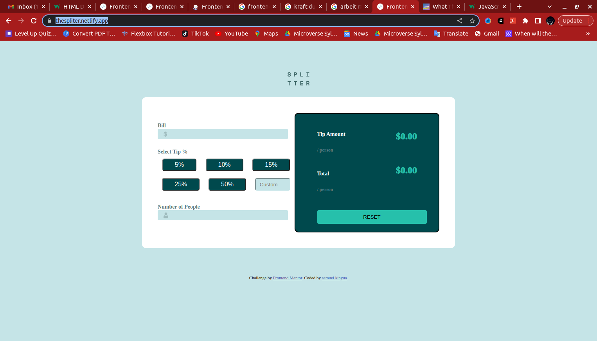

# Frontend Mentor - Tip calculator app solution

This is a solution to the [Tip calculator app challenge on Frontend Mentor](https://www.frontendmentor.io/challenges/tip-calculator-app-ugJNGbJUX). Frontend Mentor challenges help you improve your coding skills by building realistic projects.

## Table of contents

- [Overview](#overview)
  - [The challenge](#the-challenge)
  - [Screenshot](#screenshot)
  - [Links](#links)
- [My process](#my-process)
  - [Built with](#built-with)
  - [What I learned](#what-i-learned)
  - [Continued development](#continued-development)
  - [Useful resources](#useful-resources)
- [Author](#author)

## Overview
this is a web app that is build using html css and javascript. I alllows the users to split the bill and calculate a tip percentage that they would like to to give. it then displays the tip amount per person and the total amount to be paid per person.
### The challenge

Users should be able to:

- View the optimal layout for the app depending on their device's screen size
- See hover states for all interactive elements on the page
- Calculate the correct tip and total cost of the bill per person

### Screenshot

### Links

- Solution URL: [Add solution URL here](https://github.com/samuel-kinyua/tip-calculator)
- Live Site URL: [Add live site URL here](https://thespliter.netlify.app/)

## My process
I created the markup for this app using the HTML and css to style the page by adding the colors, fonts and created the layout using Flexbox. additionally, I used the media querry to make the page responsive for smaller screens such us mobile phones. finally I used JavaScript and DOM manupulaion to add functionally to the app which enables the calculation and display of the results.

### Built with

- Semantic HTML5 markup
- CSS custom properties
- Flexbox
- media querry

### What I learned

While creating this project I learnt quit a number of things. first, I learnt how to use media queries to simplify the responsive ness of the app on different sized screens. secondly, I learnt how to perform DOM  manuplation. third, I learnt how to create better layouts using flexbox

### Continued development

for the future projects I would like to continualy improve on creation of laouts using flexbox and to create flexibility using javaScript and DOM manuplation.

### Useful resources

some of the resources that I found helpful while tackling this project include:
1) what the flexbox - by wes bos (https://flexbox.io/)
2) JavaScript HTML DOM - by w3school (https://www.w3schools.com/js/js_htmldom.asp)

## Author

- Frontend Mentor - [@samuelkinyua](https://www.frontendmentor.io/profile/yourusername)
- Twitter - [@muthuimkenya047](https://www.twitter.com/yourusername)

